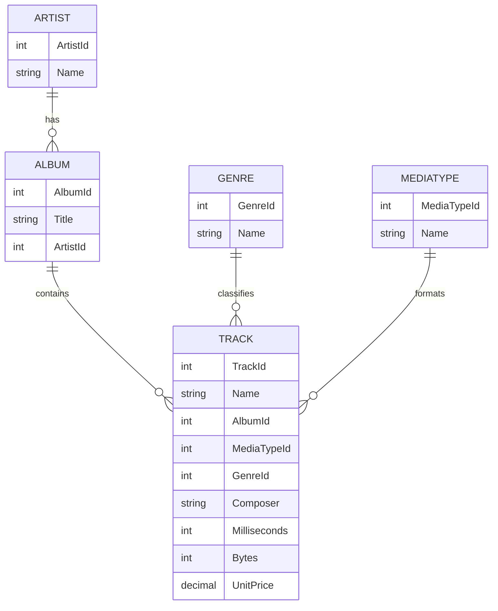

# Project Documentation

## 1. Resumen del backend

Este proyecto es un backend REST construido con FastAPI sobre una base de datos Chinook. Expone operaciones de autenticación JWT y CRUD para artistas, álbumes, géneros, tracks y usuarios.

La aplicación está pensada como ejemplo didáctico de arquitectura backend moderna: usa programación asíncrona, SQLAlchemy con `AsyncSession`, modelos Pydantic para entrada y salida, y una capa de repositorios y servicios para separar responsabilidades.

### Qué resuelve

- Autenticación con Bearer token JWT.
- Protección de rutas con validación de usuario autenticado y activo.
- CRUD de catálogo musical sobre tablas del esquema Chinook.
- Respuestas enriquecidas en álbumes y tracks para evitar que el cliente tenga que resolver relaciones manualmente.
- Creación automática del esquema y carga de usuarios de demostración al iniciar la app.

## 2. Arquitectura general

### Capas principales

- `app/main.py`: crea la aplicación FastAPI, configura CORS, inicializa el esquema y registra routers.
- `app/api/v1/router.py`: concentra todas las rutas de la versión `v1`.
- `app/api/dependencies.py`: define la validación de JWT y la verificación de usuario activo.
- `app/core/database.py`: configura la conexión asíncrona a la base de datos y la sesión.
- `app/core/security.py`: maneja hash de contraseñas y generación de tokens.
- `app/auth/*`: autenticación, modelo de usuario, login y seed de usuarios demo.
- `app/artists/*`, `app/albums/*`, `app/genres/*`, `app/track/*`: dominios CRUD del catálogo.
- `app/users/*`: endpoints administrativos para listar y crear usuarios.

### Flujo de inicio

1. Se cargan las variables de entorno desde `.env`.
2. Se inicializa logging.
3. En el lifespan de la app se ejecuta `Base.metadata.create_all()`.
4. Se insertan los usuarios demo si no existen.
5. La aplicación queda lista para servir rutas y Swagger.

### Persistencia

- Base de datos por defecto: `sqlite+aiosqlite:///./instance/Chinook.db`.
- La sesión se administra con `AsyncSessionLocal`.
- `get_db()` hace commit automático al final de la operación y rollback si ocurre una excepción.

### Serialización de modelos

Los schemas usan `CustomModel`, que configura:

- `from_attributes=True` para leer directamente desde objetos ORM.
- `datetime` serializado como ISO 8601.
- `Decimal` serializado como `float`.

## 3. Autenticación y autorización

La autenticación usa JWT firmado con `HS256`.

### Login

Endpoint:

- `POST /api/v1/auth/token`

Body:

```json
{
  "username": "admin",
  "password": "admin123"
}
```

Respuesta:

```json
{
  "access_token": "...",
  "token_type": "bearer"
}
```

### Reglas de seguridad

- El token se lee desde el header `Authorization: Bearer <token>`.
- El esquema de seguridad registrado en Swagger es `bearerAuth`.
- `get_current_user()` valida firma, expiración y existencia del usuario.
- `get_current_active_user()` además bloquea usuarios con `disabled = true`.

### Usuarios de demostración

Al iniciar la app se crean, si no existen:

- `admin` / `admin123`
- `reader` / `reader123`

`reader` está inactivo para probar la validación de usuario activo.

## 4. Mapa de endpoints

Todos los endpoints de catálogo y usuarios quedan bajo el prefijo configurado en `API_V1_STR`, que por defecto es `/api/v1`.

### Root y documentación

- `GET /` retorna un mensaje simple de salud.
- `GET /docs` abre Swagger UI.
- `GET /redoc` abre la documentación alternativa de FastAPI.

### Autenticación

| Método | Ruta | Protegido | Descripción |
| --- | --- | --- | --- |
| `POST` | `/api/v1/auth/token` | No | Autentica con username y password y devuelve un JWT. |

### Usuarios

| Método | Ruta | Protegido | Descripción |
| --- | --- | --- | --- |
| `GET` | `/api/v1/users` | Sí | Lista usuarios registrados. |
| `POST` | `/api/v1/users` | Sí | Crea un nuevo usuario con contraseña hasheada. |

### Artistas

| Método | Ruta | Protegido | Descripción |
| --- | --- | --- | --- |
| `POST` | `/api/v1/artists/` | Sí | Crea un artista. |
| `GET` | `/api/v1/artists/` | Sí | Lista artistas con paginación por `skip` y `limit`. |
| `GET` | `/api/v1/artists/{artist_id}` | Sí | Obtiene un artista por id. |
| `PATCH` | `/api/v1/artists/{artist_id}` | Sí | Actualiza parcialmente un artista. |
| `DELETE` | `/api/v1/artists/{artist_id}` | Sí | Elimina un artista. |

### Álbumes

| Método | Ruta | Protegido | Descripción |
| --- | --- | --- | --- |
| `POST` | `/api/v1/albums/` | Sí | Crea un álbum. |
| `GET` | `/api/v1/albums/` | Sí | Lista álbumes con paginación. |
| `GET` | `/api/v1/albums/{album_id}` | Sí | Obtiene un álbum por id. |
| `PATCH` | `/api/v1/albums/{album_id}` | Sí | Actualiza parcialmente un álbum. |
| `DELETE` | `/api/v1/albums/{album_id}` | Sí | Elimina un álbum. |

### Géneros

| Método | Ruta | Protegido | Descripción |
| --- | --- | --- | --- |
| `POST` | `/api/v1/genres/` | Sí | Crea un género. |
| `GET` | `/api/v1/genres/` | Sí | Lista géneros con paginación. |
| `GET` | `/api/v1/genres/{genre_id}` | Sí | Obtiene un género por id. |
| `PATCH` | `/api/v1/genres/{genre_id}` | Sí | Actualiza parcialmente un género. |
| `DELETE` | `/api/v1/genres/{genre_id}` | Sí | Elimina un género. |

### Tracks

| Método | Ruta | Protegido | Descripción |
| --- | --- | --- | --- |
| `POST` | `/api/v1/tracks` | Sí | Crea un track. |
| `GET` | `/api/v1/tracks` | Sí | Lista tracks con paginación. |
| `GET` | `/api/v1/tracks/{track_id}` | Sí | Obtiene un track por id. |
| `PATCH` | `/api/v1/tracks/{track_id}` | Sí | Actualiza parcialmente un track. |
| `DELETE` | `/api/v1/tracks/{track_id}` | Sí | Elimina un track. |

## 5. Esquemas de entrada y salida

### Auth

#### `UserLogin`

- `username`: string
- `password`: string

#### `Token`

- `access_token`: string
- `token_type`: string, por defecto `bearer`

### Users

#### `UserCreate`

- `username`: string
- `email`: string
- `full_name`: string opcional
- `disabled`: boolean, por defecto `false`
- `password`: string

#### `User`

- `user_id`: integer opcional
- `username`: string
- `email`: string opcional
- `full_name`: string opcional
- `disabled`: boolean

La contraseña nunca se devuelve en la respuesta.

### Artists

#### `Create`

- `Name`: string

#### `Update`

- `Name`: string opcional

#### `Response`

- `ArtistId`: integer
- `Name`: string

### Albums

#### `Create`

- `Title`: string
- `ArtistId`: integer

#### `Update`

- `Title`: string opcional
- `ArtistId`: integer opcional

#### `Response`

- `AlbumId`: integer
- `Title`: string
- `ArtistId`: integer
- `ArtistName`: string opcional

### Genres

#### `Create`

- `Name`: string

#### `Update`

- `Name`: string opcional

#### `Response`

- `GenreId`: integer
- `Name`: string

### Tracks

#### `Create`

- `Name`: string
- `AlbumId`: integer opcional
- `MediaTypeId`: integer obligatorio
- `GenreId`: integer opcional
- `Composer`: string opcional
- `Milliseconds`: integer obligatorio
- `Bytes`: integer opcional
- `UnitPrice`: decimal obligatorio

#### `Update`

- `Name`: string opcional
- `AlbumId`: integer opcional
- `MediaTypeId`: integer opcional
- `GenreId`: integer opcional
- `Composer`: string opcional
- `Milliseconds`: integer opcional
- `Bytes`: integer opcional
- `UnitPrice`: decimal opcional

#### `Response`

- `TrackId`: integer
- `Name`: string
- `AlbumId`: integer opcional
- `MediaTypeId`: integer
- `GenreId`: integer opcional
- `Composer`: string opcional
- `Milliseconds`: integer
- `Bytes`: integer opcional
- `UnitPrice`: decimal
- `AlbumTitle`: string opcional
- `GenreName`: string opcional
- `MediaTypeName`: string opcional

## 6. Estructura de modelos de base de datos

### User

Tabla: `User`

- `UserId`: primary key, integer
- `Username`: string, único, índice, no nulo
- `Email`: string, único, índice, no nulo
- `FullName`: string opcional
- `Disabled`: boolean, no nulo, por defecto `false`
- `HashedPassword`: string, no nulo

### Artist

Tabla: `Artist`

- `ArtistId`: primary key, integer
- `Name`: string de hasta 120 caracteres

### Album

Tabla: `Album`

- `AlbumId`: primary key, integer
- `Title`: string de hasta 160 caracteres, no nulo
- `ArtistId`: foreign key a `Artist.ArtistId`, no nulo

### Genre

Tabla: `Genre`

- `GenreId`: primary key, integer
- `Name`: string de hasta 120 caracteres

### MediaType

Tabla: `MediaType`

- `MediaTypeId`: primary key, integer
- `Name`: string de hasta 120 caracteres

### Track

Tabla: `Track`

- `TrackId`: primary key, integer
- `Name`: string de hasta 200 caracteres, no nulo
- `AlbumId`: foreign key a `Album.AlbumId`, opcional
- `MediaTypeId`: foreign key a `MediaType.MediaTypeId`, no nulo
- `GenreId`: foreign key a `Genre.GenreId`, opcional
- `Composer`: string de hasta 220 caracteres, opcional
- `Milliseconds`: integer, no nulo
- `Bytes`: integer, opcional
- `UnitPrice`: numeric(10,2), no nulo

## 7. Relaciones entre modelos

La aplicación implementa estas relaciones ORM:

- `Artist` 1 a N `Album`
- `Album` 1 a N `Track`
- `Genre` 1 a N `Track`
- `MediaType` 1 a N `Track`

### Diagrama ER simplificado



### Campos derivados expuestos por la API

- `Album.ArtistName` se obtiene desde la relación `album.artist.Name`.
- `Track.AlbumTitle` se obtiene desde `track.album.Title`.
- `Track.GenreName` se obtiene desde `track.genre.Name`.
- `Track.MediaTypeName` se obtiene desde `track.media_type.Name`.

## 8. Repositorios y comportamiento CRUD

La mayor parte de las entidades usa `BaseRepository`, que implementa:

- `get(id)` para buscar por primary key.
- `get_multi(skip, limit)` para paginación simple.
- `create()` para insertar y refrescar el objeto.
- `update()` para aplicar solo campos enviados en el payload.
- `delete()` para eliminar si el registro existe.

### Extensiones por dominio

- `AlbumRepository` carga `artist` con `joinedload` para devolver `ArtistName`.
- `TrackRepository` carga `album`, `genre` y `media_type` con `joinedload` para devolver nombres relacionados.
- `ArtistRepository` agrega búsqueda por nombre y trazas de logging.

## 9. Respuestas y códigos de estado

- `200 OK`: lectura y actualización exitosa.
- `201 Created`: creación de recurso exitosa.
- `204 No Content`: eliminación exitosa.
- `400 Bad Request`: usuario inactivo.
- `401 Unauthorized`: token inválido, ausente o credenciales incorrectas.
- `404 Not Found`: recurso inexistente.
- `409 Conflict`: usuario ya existente por username o email.

## 10. Variables de entorno

Variables mínimas soportadas:

- `DATABASE_URL`
- `SECRET_KEY`
- `ACCESS_TOKEN_EXPIRE_MINUTES`
- `API_V1_STR`
- `LOG_FILE_PATH`
- `LOG_LEVEL`

Valores por defecto relevantes:

- `DATABASE_URL = sqlite+aiosqlite:///./instance/Chinook.db`
- `API_V1_STR = /api/v1`
- `ACCESS_TOKEN_EXPIRE_MINUTES = 30`
- `LOG_LEVEL = DEBUG`

## 11. Validación y pruebas

La suite del proyecto incluye pruebas de JWT y del flujo CRUD de tracks.

Comando sugerido:

```bash
python -m unittest discover -s tests -p "test_*.py"
```

La prueba de tracks valida el ciclo completo:

- listar
- crear
- leer por id
- actualizar
- eliminar

## 12. Conclusión

En conjunto, este backend funciona como una API de catálogo musical segura y asíncrona, con autenticación JWT, rutas protegidas por usuario activo y una capa de persistencia basada en SQLAlchemy sobre el esquema Chinook. La implementación prioriza claridad pedagógica, separación de responsabilidades y respuestas enriquecidas para facilitar el consumo desde frontend o herramientas como Swagger.